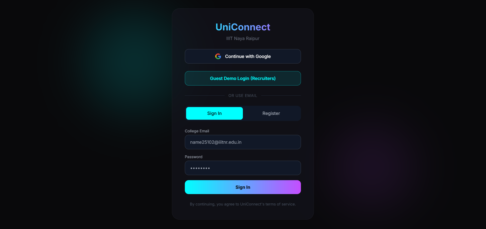
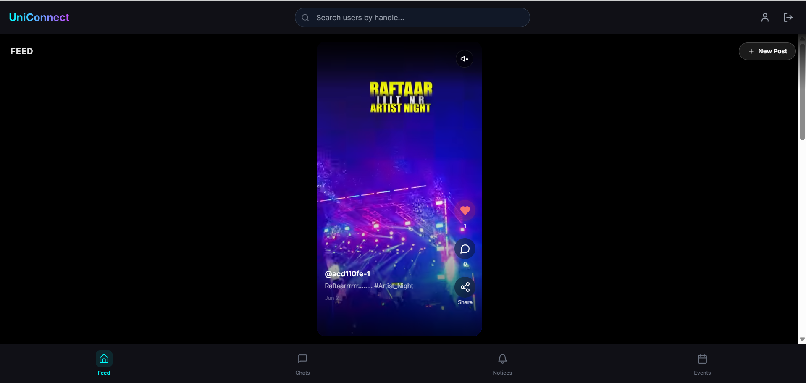
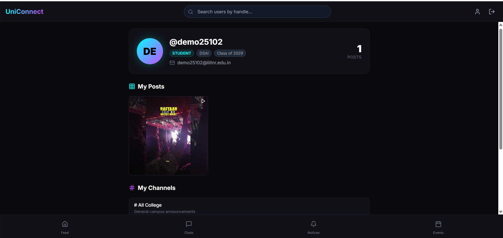

<div align="center">
  
  <h1>UniConnect</h1>
  <p><strong>A private, institution-locked campus networking & social platform.</strong></p>
  
  [](https://nextjs.org/)
  [](https://supabase.com/)
  [](https://www.typescriptlang.org/)
  [](https://tailwindcss.com/)
  
  <br />
  <a href="https://uniconnect-eight.vercel.app/" target="_blank"><strong>🌐 View Live Deployment</strong></a> • <a href="#features">Explore Features</a> • <a href="#setup">Installation</a>
</div>

<br />

> ⚠️ **Recruiters & Hiring Managers:** Since this platform is strictly locked to `@iiitnr.edu.in` emails via Google OAuth, a **Demo Login** has been provided on the landing page so you can explore the application without needing a college email. 

---

## 📸 Screenshots

| Landing & Auth | The Feed (Reels) | User Profile |
|:---:|:---:|:---:|
|  |  |  |

*(Replace the placeholder URLs above with actual screenshots of your deployed app!)*

---

## 🚀 Overview

UniConnect is a full-stack web application designed to be the digital hub for IIIT Naya Raipur. It combines the engagement of an Instagram Reels-style video feed with the utility of real-time group messaging and campus noticeboards. 

The application is heavily secured—**Google OAuth strictly rejects any non-institutional email at the callback level.** If a valid college email is used, the system automatically parses the email (e.g., `name25102@iiitnr.edu.in`) to extract the user's batch year (2025) and branch (CSE), instantly generating their profile and auto-enrolling them in the correct campus chat groups.

## ✨ Features

- 🔐 **Zero-Config Institutional Auth:** Domain-locked Google OAuth that auto-parses identity (Branch, Batch, Roll No) directly from the email string.
- 🎬 **TikTok/Reels Style Video Feed:** 9:16 aspect ratio feed supporting native device uploads (via Supabase Storage) and YouTube embeds.
- 🕹️ **Custom Video Controls:** YouTube videos are embedded with `controls=0` to hide native UI, utilizing the YouTube IFrame `postMessage` API for custom play/pause/mute overlays.
- 🔄 **Real-Time Everything:** Likes, comments, and group chat messages sync instantly across all clients using **Supabase Realtime** (WebSocket channels).
- 🧑‍💻 **Comprehensive Profile System:** Users get an Instagram-style 3-column post grid. They can edit captions, manage comments, and delete posts.
- 🔎 **Live User Search:** Debounced `ilike` database queries allow instant searching for peers by handle.

## 🛠️ Tech Stack

- **Frontend:** Next.js 14 (App Router), React 18, Tailwind CSS, Framer Motion, Lucide Icons.
- **Backend (BaaS):** Supabase (PostgreSQL Database, Auth, Realtime WebSockets, Storage).
- **Language:** TypeScript (Strict mode).
- **Integrations:** YouTube IFrame API, n8n (Webhooks for automation).
- **Deployment:** Vercel (Frontend), Supabase Cloud (Database/Backend).

## 🏗️ Architecture

- **Routing & Protection:** Next.js Middleware protects all `/dashboard/*` routes. Unauthenticated users are hard-redirected to `/auth`.
- **Database Schema:** 
  - `users`: Core profile data (auto-generated).
  - `posts`, `post_likes`, `post_comments`: The core of the feed engagement.
  - `groups`, `group_members`, `messages`: The real-time chat architecture.
  - `events`, `notices`: Campus bulletin boards.
- **Optimistic UI:** When a user "Likes" a post, the UI updates instantly while the Supabase mutation happens asynchronously in the background, ensuring zero latency perception.
- **Keep-Alive Cron:** A Next.js API route (`/api/keep-alive`) combined with `vercel.json` crons automatically pings the Supabase database daily to prevent the free-tier project from pausing due to inactivity.

## ⚙️ Setup & Installation

If you'd like to run this project locally:

1. **Clone the repository:**
   ```bash
   git clone https://github.com/yourusername/uniconnect.git
   cd uniconnect
   ```

2. **Install dependencies:**
   ```bash
   npm install
   ```

3. **Environment Variables:**
   Rename `.env.example` to `.env.local` and add your Supabase credentials.
   ```env
   NEXT_PUBLIC_SUPABASE_URL=your_supabase_url
   NEXT_PUBLIC_SUPABASE_ANON_KEY=your_supabase_anon_key
   ```

4. **Run the development server:**
   ```bash
   npm run dev
   ```
   Navigate to `http://localhost:3000`.

## 🤝 Contributing & Future Roadmap
- [ ] Implement AI-driven content moderation for the feed.
- [ ] Add direct 1-on-1 messaging (currently supports groups).
- [ ] Integrate full n8n automation for scraping college notices into the DB.

## 📄 License
This project is licensed under the MIT License - see the [LICENSE](LICENSE) file for details.
